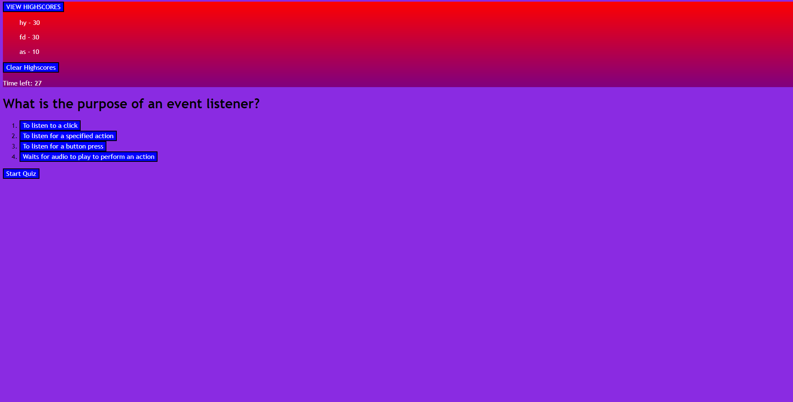

# javascriptQuiz

## Description

Provide a short description explaining the what, why, and how of your project. Use the following questions as a guide:

- A local school contracted me to create a short 'pop quiz' for their javascript students this week. It has 7 different questions with 4 multiple choice answers per question.
The quiz has a highscore leaderboard so the students can have a friendly competition to see who can 'out javascript the other'. It only lists the top 5 scores in the class
but that also makes it very competetive.
- By creating this quiz, I learned how to make use of local storage to hold the saved scores from the previous tests saved. I also learned that ternary expressions can be used in place of 'if---else' statements in certain situations. I also created the buttons for the options on the quiz dynamically using javascript which increased efficiency rather than hard assigning a select amount of buttons.

## Snippet

## Deployed application link

https://neuy16.github.io/javascriptQuiz/